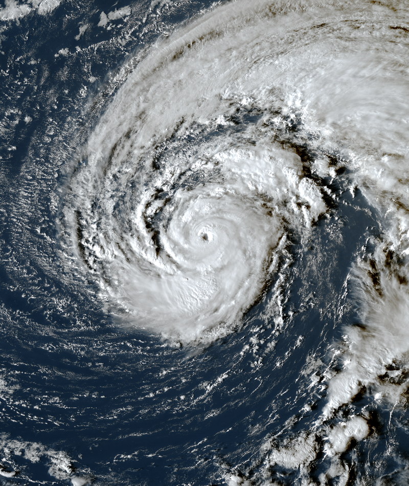
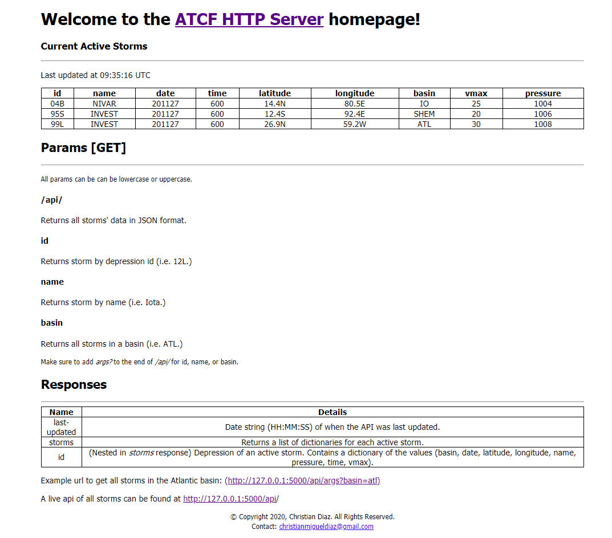

# ATCF HTTP Server

A development RESTful Flask server that returns JSON data of [ATCF storm data](#sources).  

## How it works
The server has 2 main threads.  A Flask thread is initialized at startup as well as the ATCFServer thread.

#### Flask Thread
This thread starts a flask development server on the user selected IP and port (if none is supplied localhost and port 5000 are used.)
Once a client sends a GET request to the server, a JSON response is delivered based on the parameters supplied. Most data is 
gathered from `data.json` and `data.csv`, and is processed in `get_data.py` and `data_processing.py`.

Each client IP is limited to a certain amount of requests based on which config is used. For more info, see 
[Server Installation and Startup](#server-installation-and-startup).

#### ATCFServer Thread
When ran, a request is sent to the [ATCF Sector file](https://www.nrlmry.navy.mil/tcdat/sectors/atcf_sector_file), and data 
is formatted and written to both `data.csv` and `data.json` if the request was successful.  If unsuccessful, based on the 
error code the thread will either attempt another request, or will wait until the next 15 minute interval to send a request.  

This thread is ran at startup, as well as at 15 minute intervals (i.e. 0015, 0030, 0045, etc).

## How to use
### Server installation and startup
[Python 3.9](https://www.python.org/downloads/) is required for installation, as well as an up-to-date pip package installer. 

Clone the repository via a zip download, or from a local git installation.  Once cloned, the server can be run by running
`run.bat` (Windows) or `run.sh` (Linux/MacOS).  This will first check if a virtual environment exists in the directory, and will 
install all packages in `requirements.txt` to the virtual environment or - if no virtual environment is detected - the system environment.
This will run the server on localhost (127.0.0.1) and port 5000 by default.

To change the IP address and/or port used, you can create an .env file containing the following values:
* For development: `DEV_FLASK_IP` and `DEV_FLASK_PORT`
* For production: `PROD_FLASK_IP` and `PROD_FLASK_PORT`

To use the development environment variables, the `DevelopmentConfig` must be loaded from `config.py`.  The production variables
can be loaded using the `StagingConfig` and `ProductionConfig`. By default, `DevelopmentConfig` is loaded in `src/__init__.py`

Depending on what config is used, the requests limit is changed, with `DevlopmentConfig` and `TestingConfig` having the 
least strict limits.  Request limits are implemented with [flask limiter](https://github.com/alisaifee/flask-limiter).

### Client
Clients will need to send a HTTP GET request in order to get data.  

To see examples as well with parameters, check out the [client documentation](docs/CLIENT.md) or the [index file](http://127.0.0.1:5000) (only accessible if server is running on localhost)

<small>Example Index</small>

## Contributing
Contributors are welcomed! To contribute:
* Follow (loosely) the guidelines set in [CONTRIBUTING.md](docs/CONTRIBUTING.md)

The guidelines are not required to be followed strictly, however they are there to optimize your pull requests/issue reports to be
constructive as possible.

If you have any questions/inquires related to the project, don't hesitate to contact me [@chrisd149](#contact).

## Contact
I can be contacted via the following methods:
* Email: `christianmigueldiaz@gmail.com`
* Discord: `chrisd149#7640`

I will try my best to respond to legitimate questions/inquires at soon as possible, however it may take me a few days at 
most.

## Licensing
This project uses the [MIT License](LICENSE.md).

## Sources
* ATCF - Automated cyclone software that is maintained by the US Naval Research Laboratory.  Every 6 hours (UTC-0), the [ATCF Sector file](https://www.nrlmry.navy.mil/tcdat/sectors/atcf_sector_file) is updated with all current cyclones' data, including name, depression ID, pressure, max 1-minute winds, and GPS coordinates.

* NOAA - Extraneous imagery used (i.e. Satelite image of Hurricane Epsilon at [the top of the README](#atcf-http-server))
